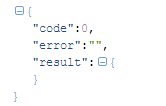
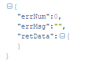

# Renovace 
###一款基于Retrofit2 & RxJava 实现简单易用的网络请求框架

Retrofit和Rxjava也许是当下异常火爆的2个开源框架，均来自神一般的Square公司。网上现在也已经有了许多对这2个框架的介绍了，
本框架能支持任意数据结构的数据，已经能满足现在的大部分网络请求！
 
##Introduce：
现在项目需求越来越多，api随之越来越多，本人的项目api数就已达120+，如果都把这些api放入一个ApiService内，加上注释显的格外长，而且不利于查看api。
于是采用第二种，以模块的形式对api进行分类，每个模块下对应若干个api，但是以retrofit的形式需要创建若干个ApiService, 虽然这种方式对于维护很方便，
但是模块数多了，效果也不是很好。对于懒人来说，如果有种统一的方法请求网络数据，你只要传入一个URL，就能回调你所需要的数据，对于这种形式再适合不过。
于是Renovace应运而生。

##Advantage
- 支持任意数据结构的解析
- 加载数据过程中，UI更流畅
- 加入基础API，减少Api冗余
- 支持网络缓存
- 支持固定添加header和动态添加header
- 支持文件下载和上传
- 支持取消数据请求
- 返回结果的统一处理
- 统一请求访问网络的流程控制
- 支持自定义Retrofit
- 支持自定义Okhttpclient
- 支持自定义的扩展API
- 结合RxJava，线程智能控制.

##Usage
###init()
初始化1:Renovace内部会创建一个默认的Retrofit和Okhttpclient。

     Renovace.getInstance().init(baseUrl);
初始化2: Renovace内部会创建一个默认的Retrofit，用户可自定义Okhttpclient。

    Renovace.getInstance().init("http://apis.baidu.com", new IRenovace.IHttpClient() {
                @Override
                public OkHttpClient getHttpClient() {
                    return new OkHttpClient.Builder()
                             //拦截器的顺序必须是先RenovaceInterceptor，然后再是CacheInterceptor等等。。。
                             //添加日志拦截器
                            .addInterceptor(new RenovaceLog())
                            //必须添加RenovaceInterceptor, 否则本框架的许多功能您将无法体验
                            .addInterceptor(new RenovaceInterceptor())
                            //添加缓存拦截器
                            .addInterceptor(new CacheInterceptor(MainActivity.this))
                            //设置缓存路径
                            .cache(RenovaceCache.getCache(MainActivity.this))
                            .retryOnConnectionFailure(true)
                            .connectTimeout(5, TimeUnit.SECONDS)
                            .build();//设置超时;
                }
            });
初始化3:用户自定义retrofit和okhttpclient

    Renovace.getInstance().init(new IRenovace() {
            @Override
            public Retrofit getRetrofit() {
                return new Retrofit.Builder()
                        .baseUrl(baseUrl)
                        .client(okHttpClient)
                        .addConverterFactory(GsonConverterFactory.create())
                        .addCallAdapterFactory(RxJavaCallAdapterFactory.create())
                        .validateEagerly(Utils.DEBUG)
                        .build();;
            }
        });
###BaseBean
Renovace内部是靠RenovaceBean<T> 进行解析的，如果你的数据结构跟RenovaceBean不同，你可以在你的项目中继承RenovaceBean，然后重写getResult和getCode等方法来实现自己的需求。
####eg:
默认的数据结构为:

如果你的数据结构是这样的：

那么你的basebean可以写成这样

    public class BaiduApiBean<T> extends RenovaceBean<T>{
    int errNum;
    String errMsg;
    T retData;

    @Override
    public int getCode() {
        return errNum;
    }

    @Override
    public void setCode(int code) {
        errNum = code;
    }

    @Override
    public String getError() {
        return errMsg;
    }

    @Override
    public void setError(String error) {
        errMsg = error;
    }

    @Override
    public T getResult() {
        return retData;
    }

    @Override
    public void setResult(T result) {
        this.retData = result;
    }

###get()
get方式提供了3种实现

1，此种方式适用的数据结构为  {"code":0,"error":"", "result":{"name":"renovace"}}, 返回的数据实体为result对于的bean

    Renovace.getInstance().getResult(String apiUrl, RenovaceHttpProxy<Your Bean> proxy); 
    Renovace.getInstance().getResult(String apiUrl, RequestParams params，RenovaceHttpProxy<Your Bean> proxy);

2，此种方式适用的数据结构为 { "code":0, "name":"renovace" }，返回的数据实体为整个bean，其中已经对code进行了判断，如果不是成功的code，则回调onError，并将错误信息写入exception。

    Renovace.getInstance().getBean(String apiUrl, RenovaceHttpProxy<Your Bean> proxy); 
    Renovace.getInstance().getBean(String apiUrl, RequestParams params，RenovaceHttpProxy<Your Bean> proxy);

3，此种方式为完全自定义数据结构，{ "xxx":"xxxxxx", "xxxxxx":"xxxxxxxxxxxxxx" }，返回的数据为整个bean，

    Renovace.getInstance().getDirect(String apiUrl, IRenovaceCallBack callback);
    Renovace.getInstance().getDirect(String apiUrl, RequestParams params, IRenovaceCallBack callback);

###post()
Post也提供了与get一样的3种实现方式,具体使用方法你只需将get替换成post即可！！！

###注意
如果你的数据结构适合第一或第二种，你只需要定义一个类实现IRenovaceCallBack即可，
eg：

       private void getTaobaoApiModel(String ip, IRenovaceCallBack<TaobaoApiModel> callBack) {
            RequestParams parameters = new RequestParams();
            parameters.put("ip", ip);
            Renovace.getInstance().postResult("service/getIpInfo.php", parameters,
            new RenovaceHttpProxy<TaobaoApiBean<TaobaoApiModel>>(callBack) {
            });
       }

然后调用：

        Renovace.getInstance().init("http://ip.taobao.com/");
        getTaobaoApiModel("119.75.217.109", new HttpCallback<TaobaoApiModel>() {
            @Override
            public void onSuccess(TaobaoApiModel response) {
                showToast(response.toString());
            }

            @Override
            public void onFinish(NetErrorBean errorBean) {
                super.onFinish(errorBean);
                showToast(errorBean);
            }
        });
    }

PS: 例子中Renovace.getInstance().init("xxx")，在你的实际项目中，你只需初始化一次就够了，demo中是为了测试不同的接口才初始化了不同的baseurl

###缓存
本框架实现了缓存，而且可根据每个接口的需求自行设置是否需要缓存，使用方法也很简单，
首先在设置okhttpclient的时候，需要依次添加RenovaceInterceptor和CacheInterceptor，然后设置缓存cache

        .addInterceptor(new RenovaceInterceptor())
        .addInterceptor(new CacheInterceptor(MainActivity.this))
        .cache(RenovaceCache.getCache(MainActivity.this))

然后你调用的时候，如果该接口需要设置缓存，你可以new RequestParams(RenovaceCache.CacheStrategy.CacheFirst)，
其中提供了2中缓存策略，分别为CacheFirst和networkfirst.
如果该接口不需要设置缓存，你在添加RequestParams的时候，new RequestParams()即可。

###添加Header
####添加固定Header
如果你的项目要添加固定的header，比如APPkey之类的，你可以
在初始化Okhttpclient的时候,你可以添加HeaderInterceptor拦截器，eg:

        HashMap<String, String> headers = new HashMap<>();
        headers.put("apikey", "e084abf9f93a9ec92c35e165b33bb9b3");

        //... 初始化okhttpclient的代码
        .addInterceptor(new HeaderInterceptor(headers))

####添加动态Header
本项目还支持动态添加header,比如某个接口需要添加header,其他接口不需要，在这种需求下，Renovace很轻松就能实现动态添加
header,使用方法很简单，跟设置缓存一样，在初始化okhttpclient的时候，你只需须添加RenovaceInterceptor拦截器，
然后在RequestParams中addHeader(String key,String value)即可，eg:

        RequestParams parameters = new RequestParams();
        parameters.put("ip", "119.75.217.109");
        parameters.addHeader("apikey", "e084abf9f93a9ec92c35e165b33bb9b3");

###自定义API
Renovace提供了用户自定义ApiService的接口，您只需调用call方法即可
eg:

    public interface TestApi {
    	@GET("app.php")
    	Observable<SouguBean> getSougu(@QueryMap Map<String, String> maps);
	}

	Renovace.getInstance().init("http://lbs.sougu.net.cn/");
    HashMap<String, String> parameters = new HashMap<>();
    parameters.put("m", "souguapp");
    parameters.put("c", "appusers");
    parameters.put("a", "network");

    TestApi testApi = Renovace.getInstance().create(TestApi.class);
    Renovace.getInstance().call(testApi.getSougu(parameters), new RenovaceCallback<SouguBean>(this) {
        @Override
        public <T> void onSuccees(T bean) {
            showToast(bean.toString());
        }
    });

[更多内容>>>](http://blog.csdn.net/u013555324/article/details/52973007)
